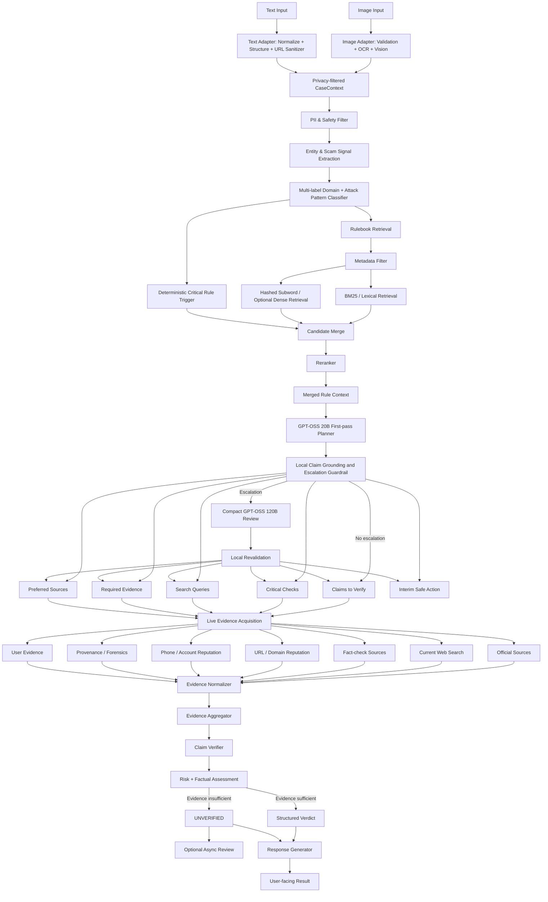

# RAG Architecture — Rulebook-Guided Multimodal Investigation

**Version:** 1.1  
**Tujuan:** Arsitektur teknis penerapan Retrieval-Augmented Generation (RAG) berbasis rulebook untuk AI agent yang melakukan investigasi scam dan fact-checking kontekstual.

---

## 1. Prinsip Arsitektur

RAG pada sistem ini **bukan database berita atau fakta aktual**. Corpus berisi *stable investigation knowledge*: pola penipuan, critical indicators, red flags, verification questions, investigation procedures, search templates, evidence requirements, source hierarchy, decision guidance, safe actions, dan escalation rules.

Prinsip utamanya:

> **Rulebook RAG menjawab “bagaimana kasus ini harus diselidiki?”, sedangkan live evidence menjawab “apa yang benar untuk kasus ini sekarang?”**

Karena itu stable knowledge dan current evidence dipisahkan.

```text
HOW TO INVESTIGATE
= Rulebook RAG

WHAT IS TRUE NOW
= Live Evidence Retrieval

HOW STRONG THE CASE IS
= Evidence Aggregator + Claim Verifier

WHAT THE USER SHOULD DO
= Risk-aware Safe Action
```

Sistem juga wajib memisahkan:

```text
SCAM RISK ≠ FACTUAL TRUTH ≠ CONTENT AUTHENTICITY
```

Sebuah pesan dapat berisiko tinggi walaupun factual claim-nya belum selesai diverifikasi. Sebaliknya, program atau informasi yang benar dapat disampaikan melalui channel palsu.

### 1.1 Implemented baseline — 2026-08-23

Implementasi saat ini menggunakan modular monolith FastAPI dengan Rulebook RAG
lokal yang aktif pada pipeline live:

```text
255 semantic rule chunks
18 authoritative source records
17 structured deterministic triggers
BM25 lexical retrieval
deterministic hashed-subword similarity
soft domain/signal metadata scoring
phase-aware selection
bounded cache + corpus hash/staleness check
```

Hashed-subword similarity bukan learned dense embedding. Ia menjadi fallback lokal
yang reproducible untuk corpus MVP. Qdrant dan learned embedding tetap merupakan
scale-out option, bukan dependency runtime saat ini. `/api/health` melaporkan mode,
versi, jumlah record, dan hash corpus yang benar-benar sedang digunakan.

Kontrak implementasi memisahkan `RuleMatch[]` dari `Evidence[]`. Planner menerima
rule context untuk menentukan cara investigasi; verifier hanya memakai live/current
evidence untuk SUPPORT/REFUTE factual claim. Rulebook dapat memaksa safe action dan
risk posture, tetapi tidak dapat memaksa factual verdict.

Input image dan text kini diimplementasikan melalui adapter modality-specific yang
menghasilkan satu kontrak `CaseContext` privacy-filtered. Setelah boundary tersebut,
signal extraction, Rulebook RAG, planner, evidence retrieval, verifier, response,
dan trace memakai kode yang sama. Perbedaan image hanya OCR/Vision/metadata;
perbedaan text hanya normalisasi, content-type inference, sender context, dan URL
sanitization. Ini mencegah jalur text kehilangan guardrail yang tersedia pada image.

---

## 2. High-Level Architecture



---

## 3. Domain Rulebook

Target architecture menggunakan enam domain investigasi scam. Corpus runtime MVP
saat ini memiliki tiga canonical layers:

1. **General Information Integrity** (`RB-INF-001@1.0.0`)
2. **Impersonation, Phishing, Malware & Account Takeover** (`RB-ATO-001@1.2.0`)
3. **Government, Public Service & Aid** (`RB-GOV-001@1.2.0`)

General Information Integrity berlaku lintas modality dan menangani teks tempel,
source-free excerpt, attribution, missing context, temporal recirculation, angka,
source laundering, opini, satire, dan batas provenance. Domain target berikut belum
menjadi canonical corpus aktif:

1. **Transaction & Commerce**
2. **Impersonation, Phishing, Malware & Account Takeover**
3. **Investment, Lending & Money-Making**
4. **Employment, Task & Opportunity**
5. **Government, Public Service & Aid**
6. **Romance, Relationship & Trust Exploitation**

Domain harus menggunakan **multi-label classification**. Attack mechanism seperti `phishing`, `urgency`, `authority`, `OTP request`, `deepfake`, `malicious APK`, `remote access`, atau `money mule` adalah tag lintas-domain, bukan business domain tersendiri.

Contoh:

```json
{
  "primary_domain": "government_public_service",
  "secondary_domains": [
    "impersonation_phishing_ato"
  ],
  "attack_patterns": [
    "authority_impersonation",
    "malicious_apk",
    "credential_theft",
    "urgency"
  ]
}
```

---

## 4. Stage 1 — Multimodal Extraction

Input dapat berupa teks, screenshot, image, chat, social-media post, URL, QR code, dokumen, atau bukti transaksi.

Untuk image, OCR tidak boleh menjadi satu-satunya mekanisme.

```text
IMAGE
  ├── OCR
  ├── Vision-language understanding
  ├── URL extraction
  ├── QR extraction
  ├── Metadata extraction
  └── Provenance / forensic signals jika relevan
```

Recommended representation:

```json
{
  "input_type": "image",
  "ocr_text": "...",
  "visual_context": "...",
  "urls": [],
  "phone_numbers": [],
  "bank_accounts": [],
  "qr_payloads": [],
  "claimed_entities": [],
  "attachments": [],
  "metadata": {}
}
```

---

## 5. Stage 2 — Input Normalization

Normalizer menyatukan seluruh modality menjadi canonical case representation. Tugasnya meliputi normalisasi teks, deduplikasi OCR, normalisasi URL dan nomor telepon, ekstraksi domain, rekening/e-wallet, nominal, timestamp, claimed identity, requested action, dan sensitive-data request.

Setiap entity sebaiknya mempertahankan provenance, misalnya berasal dari OCR, VLM, user text, URL parser, atau metadata.

---

## 6. Stage 3 — PII & Safety Filter

Sebelum data dikirim ke retrieval, logging, community, atau external tools, sistem melakukan masking data sensitif.

PII yang perlu dipertimbangkan mencakup nama, nomor telepon, NIK, KK, alamat, rekening, e-wallet ID, email, dan identifier pribadi.

Secret berikut **tidak boleh disimpan** dalam RAG/community/log umum:

```text
OTP
PIN
password
CVV
recovery code
seed phrase
private key
API key
```

Community escalation hanya menggunakan versi yang telah di-redact.

---

## 7. Stage 4 — Entity & Scam Signal Extraction

Sistem mengekstrak signal eksplisit sebelum retrieval.

```json
{
  "claimed_identity": "BPJS",
  "channel": "whatsapp",
  "requested_action": [
    "install_apk",
    "share_otp"
  ],
  "urgency": true,
  "financial_request": false,
  "credential_request": true,
  "attachment_type": "apk",
  "authority_claim": true
}
```

Signal ini dipakai oleh classifier, deterministic rules, retrieval filters, dan planner.

Recommended attack-pattern tags antara lain:

```text
urgency
authority
fear
reward
scarcity
secrecy
credential_request
otp_request
payment_diversion
malicious_attachment
malicious_apk
remote_access
screen_sharing
fake_customer_service
lookalike_domain
fake_payment_proof
trust_seeding
deposit_to_earn
withdrawal_fee
money_mule
identity_impersonation
deepfake_impersonation
recovery_scam
romance_grooming
sextortion
```

---

## 8. Stage 5 — Deterministic Critical Rule Trigger

Safety-critical signal tidak boleh bergantung hanya pada vector similarity.

```python
if contains_otp_request:
    force_rules.append("ATO-R004")

if apk_attachment_detected:
    force_rules.append("ATO-R006")

if asks_for_pin_password_or_cvv:
    force_rules.append("ATO-R011")

if asks_for_remote_access:
    force_rules.append("ATO-R013")

if payment_required_to_get_job:
    force_rules.append("JOB-R010")

if withdrawal_requires_new_deposit:
    force_rules.append("INV-R012")

if intimate_threat_detected:
    force_rules.append("ROM-R020")
```

Rule context akhir:

```text
Semantic Retrieval
        +
Lexical Retrieval
        +
Deterministic Critical Rules
        ↓
Merged Rule Context
```

---

## 9. Corpus Chunking Strategy

Jangan chunk rulebook hanya berdasarkan token seperti:

```text
chunk_01 = token 0–700
chunk_02 = token 600–1300
```

Gunakan **satu logical rule / semantic unit sebagai satu chunk**.

Contoh:

```text
ATO-R004
Permintaan OTP
Severity: CRITICAL
```

```text
ATO-R006
Permintaan instalasi APK melalui chat
Severity: CRITICAL
```

```text
GOV-R001
Pisahkan program legitimacy dan channel legitimacy
```

```text
GOV-I004
Temukan official domain secara independen
```

Dengan demikian retrieval menjadi logical retrieval, bukan sekadar similarity terhadap potongan halaman.

---

## 10. Recommended Rule Schema

```json
{
  "rule_id": "ATO-R006",
  "rulebook_id": "RB-ATO-001",
  "domain": "impersonation_phishing_ato",
  "chunk_type": "critical_indicator",
  "title": "Instalasi APK melalui chat",
  "content": "Permintaan menginstal file APK yang dikirim melalui chat merupakan indikator risiko tinggi.",
  "attack_patterns": [
    "malicious_apk",
    "credential_theft",
    "authority_impersonation"
  ],
  "channels": [
    "whatsapp",
    "telegram",
    "sms"
  ],
  "severity": "critical",
  "source_ids": [
    "ATO-S001",
    "ATO-S003"
  ],
  "rule_origin": "source_derived",
  "freshness_dependency": "stable_rule",
  "country": "ID",
  "language": "id",
  "version": "1.2.0"
}
```

---

## 11. Chunk Type Taxonomy

| `chunk_type` | Fungsi |
|---|---|
| `scope` | Menentukan applicability |
| `attack_pattern` | Menjelaskan modus |
| `critical_indicator` | Safety-critical signal |
| `red_flag` | Supporting risk signal |
| `verification_question` | Pertanyaan yang harus dijawab |
| `investigation_step` | Prosedur investigasi |
| `search_template` | Template query |
| `evidence_requirement` | Bukti yang dibutuhkan |
| `decision_guidance` | Pedoman verdict |
| `safe_action` | Tindakan aman |
| `do_not_do` | Tindakan yang dilarang |
| `escalation_rule` | Kapan perlu escalation |
| `source_registry` | Provenance rule |

Phase-aware retrieval:

```text
PHASE 1 — Detection
critical_indicator + red_flag + attack_pattern

PHASE 2 — Investigation
verification_question + investigation_step
+ search_template + evidence_requirement

PHASE 3 — Decision
decision_guidance + evidence_requirement

PHASE 4 — Response
safe_action + do_not_do + escalation_rule
```

---

## 12. Hybrid Rulebook Retrieval

Pipeline retrieval:

```text
Domain + Attack Pattern Classification
        ↓
Metadata Filtering
        ↓
┌─────────────────────────────┐
│ BM25 / lexical retrieval    │
│ Hashed-subword / dense      │
│ Deterministic forced rules  │
└──────────────┬──────────────┘
               ↓
Merge + Deduplicate
               ↓
Reranker
               ↓
Final Rule Context
```

Contoh metadata filter:

```json
{
  "query": "pesan mengaku BPJS meminta install APK dan OTP",
  "filters": {
    "country": "ID",
    "language": "id",
    "domain": [
      "government_public_service",
      "impersonation_phishing_ato"
    ],
    "chunk_type": [
      "critical_indicator",
      "investigation_step",
      "decision_guidance"
    ]
  },
  "top_k": 20
}
```

BM25 penting untuk exact terms seperti `OTP`, `APK`, `QRIS`, `PIN`, `CVV`, `BPJS`, `DJP`, `withdrawal`, dan `deposit`. Implementasi MVP menggabungkannya dengan hashed-subword similarity yang deterministik untuk variasi bentuk kata dan typo ringan. Learned dense retrieval dapat ditambahkan setelah mempunyai benchmark yang menunjukkan peningkatan recall yang berarti.

Ambil sekitar 20–30 candidate rules, lalu rerank menjadi sekitar 6–12 rules yang paling relevan. Nilai final harus dikalibrasi dengan benchmark internal.

Conceptual rule score:

```text
final_rule_score =
    semantic_relevance
  + lexical_relevance
  + domain_match
  + attack_pattern_match
  + severity_boost
  + deterministic_force
```

---

## 13. Source Registry & Provenance

Setiap rule harus auditable.

```yaml
ATO-S003:
  institution: DJP
  document: Stop Klik - Modus Penipuan Pajak Digital
  source_type: primary_authoritative
```

Relasi:

```text
ATO-R006
   ├── ATO-S001
   └── ATO-S003
```

Source registry lebih baik berada pada structured store dan diambil melalui lookup setelah rule digunakan, bukan selalu dimasukkan dalam semantic context.

---

## 14. Storage Architecture

```text
┌───────────────────────────────┐
│ RULEBOOK RETRIEVAL STORE      │
│ Vector Index + BM25 Index     │
│                               │
│ semantic rule content         │
│ attack patterns               │
│ investigation steps           │
│ search templates              │
│ decision guidance             │
└───────────────┬───────────────┘
                │
                ▼
┌───────────────────────────────┐
│ STRUCTURED RULE STORE         │
│ PostgreSQL / JSON             │
│                               │
│ rule_id                       │
│ severity                      │
│ version                       │
│ source mapping                │
│ deterministic trigger         │
│ freshness dependency          │
└───────────────┬───────────────┘
                │
                ▼
┌───────────────────────────────┐
│ LIVE EVIDENCE LAYER           │
│                               │
│ web search                    │
│ official sources              │
│ regulator registry            │
│ reputation services           │
│ fact-check sources            │
│ provenance / forensics        │
└───────────────────────────────┘
```

Secara konseptual:

```text
BM25 + hashed-subword = current local hybrid retrieval
Learned vector + BM25 = optional scale-out retrieval
Structured DB = canonical rules & metadata
External tools = current evidence
```

---

## 15. Stage 6 — Investigation Planner

Planner menggunakan retrieved rules untuk menentukan apa yang harus diverifikasi. Planner **tidak langsung menentukan final verdict**.

Output yang diharapkan:

```json
{
  "immediate_risk": "CRITICAL",
  "claims_to_verify": [
    "Apakah BPJS menggunakan APK melalui WhatsApp untuk pembaruan data?",
    "Apakah nomor pengirim merupakan kanal resmi BPJS?"
  ],
  "critical_checks": [
    "apk_attachment_detected",
    "otp_request_detected",
    "authority_impersonation_detected"
  ],
  "required_evidence": [
    "official BPJS procedure",
    "official contact/channel",
    "official security guidance"
  ],
  "external_search_queries": [
    "site:bpjs-kesehatan.go.id APK WhatsApp pembaruan data",
    "site:bpjs-kesehatan.go.id penipuan WhatsApp OTP"
  ],
  "preferred_sources": [
    "BPJS official website",
    "Komdigi",
    "OJK",
    "Polri"
  ],
  "interim_action": "DO_NOT_INSTALL_OR_SHARE_OTP"
}
```

---

## 16. Rule-Grounded Search Generation

Search query sebaiknya dihasilkan menggunakan template dari rulebook, bukan sepenuhnya improvisasi LLM.

Rule:

```text
site:{agency_domain} "{program}"
"{agency}" penipuan WhatsApp
"{agency}" APK
"{agency}" OTP
```

Entity extractor:

```json
{
  "agency": "BPJS Kesehatan",
  "channel": "WhatsApp",
  "artifact": "APK"
}
```

Output:

```text
"BPJS Kesehatan" penipuan WhatsApp
"BPJS Kesehatan" APK
site:bpjs-kesehatan.go.id WhatsApp APK
site:bpjs-kesehatan.go.id OTP
```

Metode ini disebut **rule-grounded search generation**.

---

## 17. Stage 7 — Live Evidence Acquisition

Evidence dapat berasal dari:

```text
official institution websites
regulator websites
official registries
current web search
fact-check organizations
URL/domain reputation
phone-number reputation
bank-account/payment reputation
malware/file reputation
content provenance / media forensics
user-provided evidence
verified community evidence
```

Tidak semua tool dipanggil untuk setiap query. Planner memilih tool berdasarkan required evidence dan freshness dependency.

---

## 18. Evidence Normalization

Raw search result tidak langsung diberikan kepada verifier.

```json
{
  "evidence_id": "EV-0219",
  "claim_id": "CLAIM-02",
  "source_type": "official",
  "source_tier": 1,
  "publisher": "BPJS Kesehatan",
  "title": "...",
  "url": "...",
  "published_at": "...",
  "retrieved_at": "...",
  "stance": "CONTRADICTS",
  "evidence_summary": "Official guidance contradicts the requested procedure.",
  "relevance_score": 0.95,
  "freshness_score": 0.92,
  "authority_score": 1.0,
  "claim_evidence_score": 0.94
}
```

---

## 19. Source Trust Hierarchy

Source score berfungsi sebagai evidence weighting, bukan direct truth probability.

```text
Tier 1 — Primary authoritative
regulator, responsible agency, official bank/PJP,
official company/service, official registry

Tier 2 — High-quality independent
established fact checker, peer-reviewed research,
established journalism, recognized security advisory

Tier 3 — Verified supporting evidence
verified community or corroborated user evidence

Tier 4 — Unverified
anonymous post, forwarded screenshot, unsupported testimony
```

Tier 4 tidak boleh menjadi decisive evidence sendiri.

---

## 20. Stage 8 — Evidence Aggregator

Evidence Aggregator bertugas melakukan:

```text
deduplication
source authority assessment
recency checking
claim-evidence matching
source diversity checking
support/refute stance detection
contradiction detection
retrieval coverage assessment
evidence sufficiency assessment
```

Pipeline:

```text
Raw Evidence
    ↓
Deduplication
    ↓
Source Trust Assessment
    ↓
Claim-Evidence Matching
    ↓
Recency Check
    ↓
Contradiction Detection
    ↓
Source Diversity
    ↓
Evidence Sufficiency
```

Final reasoning menggunakan:

```text
CASE SIGNALS
+
RETRIEVED RULES
+
CURRENT EVIDENCE
+
SOURCE QUALITY
+
SOURCE AGREEMENT
+
CONTRADICTIONS
+
TEMPORAL VALIDITY
```

---

## 21. Stage 9 — Claim Verifier

Claim Verifier dipisahkan dari Response Generator. Verifier menentukan claim stance, factual status, risk level, evidence sufficiency, unresolved claims, missing evidence, dan recommended action dalam schema ketat.

Recommended factual verdict taxonomy:

```text
SUPPORTED
REFUTED
MISLEADING
PARTLY_TRUE
UNVERIFIED
OUTDATED
SATIRE
OPINION
```

Scam-specific internal findings dapat mencakup:

```text
LIKELY_IMPERSONATION
IMPERSONATION_CONFIRMED
IDENTITY_UNVERIFIED
PAYMENT_UNVERIFIED
HIGH_RISK_SCAM_PATTERN
CRITICAL_CREDENTIAL_THEFT_RISK
```

Response Generator tidak boleh mengubah hasil verifier.

---

## 22. Evidence-Based Confidence

Jangan menggunakan LLM self-reported confidence sebagai satu-satunya confidence system.

Gunakan evidence characteristics:

```text
source_quality
source_agreement
claim_evidence_relevance
retrieval_coverage
temporal_validity
claim_evidence_entailment
contradiction_penalty
```

Conceptual formula:

```text
evidence_sufficiency =
    authority
  + agreement
  + relevance
  + coverage
  + freshness
  - contradiction_penalty
```

> **LLM confidence ≠ system confidence**

Bobot aktual harus ditentukan melalui calibration dan evaluation.

---

## 23. Interim Risk vs Final Factual Verdict

System dapat memberi immediate warning sebelum factual verification selesai.

```text
OTP request
+
APK attachment
+
authority impersonation
```

dapat langsung menghasilkan:

```text
CRITICAL RISK
DO NOT INSTALL
DO NOT SHARE OTP
```

Namun untuk menyatakan identitas pengirim terbukti palsu, sistem masih membutuhkan current evidence.

Intermediate result yang valid:

```json
{
  "interim_risk": "CRITICAL",
  "factual_status": "UNVERIFIED"
}
```

Jika evidence tidak cukup, hasil akhir tetap `UNVERIFIED` dengan safe action, bukan forced binary answer.

---

## 24. Community Review

Community berfungsi sebagai **evidence contributor**, bukan truth oracle atau majority-vote engine.

Trust states:

```text
community_unverified
community_reviewed
community_verified
community_rejected
```

Escalation:

```text
Evidence insufficient
        ↓
Return UNVERIFIED immediately
        ↓
Give safe action
        ↓
PII redaction
        ↓
Optional async review
        ↓
Evidence validation
        ↓
Case update
```

Unverified community content tidak boleh masuk canonical RAG. Penyimpanan sebaiknya dipisahkan:

```text
canonical_rulebook
verified_external_sources
community_unverified
community_reviewed
community_verified
community_rejected
```

---

## 25. Prompt Guardrail

Reasoning agent perlu diberi instruksi eksplisit:

```text
RULEBOOK CONTEXT describes investigation policy,
not necessarily facts about the current case.

Do not interpret retrieved rules as proof that
the current case is fraudulent.

Use rules to determine:
- risk indicators
- required verification
- search strategy
- evidence requirements
- safe actions
- escalation conditions

Use CURRENT EVIDENCE to determine factual claims.

If evidence is insufficient:
return UNVERIFIED.
```

---

## 26. Structured Final Output

```json
{
  "case_id": "CASE-001",
  "domains": [
    "government_public_service",
    "impersonation_phishing_ato"
  ],
  "attack_patterns": [
    "authority_impersonation",
    "malicious_apk",
    "credential_theft"
  ],
  "risk": {
    "level": "CRITICAL",
    "score": 94
  },
  "dimensions": {
    "factual_status": "UNVERIFIED",
    "source_authenticity": "UNVERIFIED",
    "sender_identity": "IMPERSONATION_LIKELY",
    "channel_status": "SUSPICIOUS",
    "scam_risk": "CRITICAL",
    "content_authenticity": "NOT_APPLICABLE"
  },
  "evidence_sufficiency": 0.92,
  "key_findings": [
    {
      "finding": "Pesan meminta instalasi APK melalui chat.",
      "rule_id": "ATO-R006",
      "signal_ids": ["SIG-APK-001"],
      "evidence_ids": []
    },
    {
      "finding": "Pesan meminta OTP.",
      "rule_id": "ATO-R004",
      "signal_ids": ["SIG-OTP-001"],
      "evidence_ids": []
    },
    {
      "finding": "Prosedur tidak sesuai kanal resmi yang ditemukan.",
      "rule_id": "GOV-I005",
      "evidence_ids": ["EV-006"]
    }
  ],
  "recommended_action": [
    "Jangan instal APK.",
    "Jangan berikan OTP.",
    "Hubungi institusi melalui kanal resmi yang ditemukan secara independen."
  ],
  "evidence_quality": "HIGH",
  "missing_evidence": [],
  "rules_used": [
    "ATO-R004",
    "ATO-R006",
    "GOV-R001",
    "GOV-I005"
  ]
}
```

Response Generator hanya mengubah structured output menjadi penjelasan yang mudah dipahami pengguna. Ia tidak boleh membuat evidence baru, mengubah `UNVERIFIED` menjadi `FALSE`, atau menaikkan verdict tanpa evidence.

---

## 27. Metadata & Freshness

Recommended metadata:

```json
{
  "rulebook_id": "government_public",
  "rulebook_version": "1.2.0",
  "rule_id": "GOV-I004",
  "domain": "government_public",
  "subdomain": "social_assistance",
  "chunk_type": "investigation_step",
  "attack_pattern_tags": [
    "authority_impersonation",
    "fake_aid",
    "phishing"
  ],
  "indicator_tags": [
    "unofficial_domain",
    "payment_request",
    "urgency"
  ],
  "verification_type": [
    "program",
    "identity",
    "procedure",
    "domain",
    "payment"
  ],
  "risk_level": "high",
  "applicable_channels": [
    "whatsapp",
    "sms",
    "web",
    "social_media"
  ],
  "freshness_dependency": "stable_rule",
  "source_ids": [
    "ojk-scam-booklet-2026",
    "agency-advisory"
  ],
  "country": "ID",
  "language": "id",
  "effective_from": "2026-08-23",
  "review_after": "2027-02-23"
}
```

Recommended `freshness_dependency`:

```text
stable_rule
periodic_review
recheck_required
temporal_fact
```

Contoh:

```text
“OTP tidak boleh diberikan kepada pihak lain”
→ stable_rule

“Verifikasi identitas melalui kanal independen”
→ stable_rule

“Nomor WhatsApp resmi lembaga X adalah ...”
→ recheck_required

“Program X aktif sampai Desember 2026”
→ temporal_fact
```

---

## 28. Versioning & Rule Lifecycle

Setiap rule menyimpan:

```text
rule_id
rulebook_version
created_at
updated_at
effective_from
review_after
status
source_ids
```

Possible status:

```text
active
deprecated
under_review
replaced
```

Update flow:

```text
New authoritative source
        ↓
Rule review
        ↓
Compare with current rule
        ↓
Create revised version
        ↓
Validation
        ↓
Activate new version
        ↓
Deprecate old version
```

---

## 29. Global Rules Layer

Selain enam domain, gunakan global rules kecil untuk prinsip lintas-domain.

```text
GLOBAL-R001
Absence of a scam report does not prove safety.

GLOBAL-R002
Logo, display name, profile photo, voice, or video alone
is not sufficient identity proof.

GLOBAL-R003
Verify identity through an independently discovered official channel.

GLOBAL-R004
Failure to find evidence must not automatically become FALSE.

GLOBAL-R005
Risk and factual truth must be assessed separately.

GLOBAL-R006
Unverified community evidence cannot be decisive.

GLOBAL-R007
Never request or store OTP, PIN, password, CVV,
seed phrase, or private key.
```

---

## 30. Suggested Retrieval Pseudocode

```python
def retrieve_rule_context(case):
    classification = classify_case(case)
    forced_rules = deterministic_trigger(case)

    filters = {
        "country": "ID",
        "language": "id",
        "domains": classification.domains,
        "attack_patterns": classification.attack_patterns
    }

    lexical_candidates = bm25_search(
        query=case.normalized_text,
        filters=filters,
        top_k=20
    )

    subword_candidates = hashed_subword_search(
        query=case.normalized_text,
        filters=filters,
        top_k=20
    )

    candidates = merge_and_deduplicate(
        lexical_candidates,
        subword_candidates,
        forced_rules
    )

    reranked = rerank(
        case=case,
        candidates=candidates
    )

    return select_context(
        reranked,
        max_rules=12,
        always_include=forced_rules
    )
```

---

## 31. Suggested Investigation Pseudocode

```python
def investigate_case(case):
    normalized = normalize(case)
    safe_case = redact_sensitive_data(normalized)

    classification = classify_case(safe_case)
    rules = retrieve_rule_context(safe_case)

    plan = create_investigation_plan(
        case=safe_case,
        classification=classification,
        rules=rules
    )

    interim_risk = assess_interim_risk(
        case=safe_case,
        rules=rules
    )

    evidence = retrieve_live_evidence(plan)
    normalized_evidence = normalize_evidence(evidence)

    aggregated = aggregate_evidence(
        normalized_evidence,
        claims=plan.claims_to_verify
    )

    verification = verify_claims(
        case=safe_case,
        rules=rules,
        evidence=aggregated
    )

    verdict = build_structured_verdict(
        interim_risk=interim_risk,
        verification=verification
    )

    return generate_user_response(verdict)
```

---

## 32. Structured Agent Communication

Antar-komponen sebaiknya berkomunikasi melalui schema JSON agar audit dan debugging mudah.

Classifier:

```json
{
  "domains": [],
  "attack_patterns": [],
  "critical_signals": [],
  "entities": [],
  "needs_current_evidence": true
}
```

Planner:

```json
{
  "claims_to_verify": [],
  "critical_checks": [],
  "required_evidence": [],
  "preferred_sources": [],
  "search_queries": [],
  "interim_action": ""
}
```

Verifier:

```json
{
  "risk": {},
  "factual_status": "",
  "evidence_sufficiency": 0.0,
  "findings": [],
  "missing_evidence": [],
  "recommended_action": []
}
```

---

## 33. Cascading Error Protection

Multi-stage agentic RAG dapat mengalami:

```text
OCR error
  ↓
wrong entity
  ↓
wrong domain
  ↓
wrong rules
  ↓
wrong search query
  ↓
wrong evidence
  ↓
wrong verdict
```

Runtime menerapkan failure isolation pada boundary model eksternal:

```text
20B failure → deterministic fallback plan → optional compact 120B review
120B failure → retain locally validated plan
web retrieval failure → continue verified local stores → lower sufficiency
verifier failure → force UNVERIFIED + human review + deterministic safe actions
```

Authentication/permission error bukan operational fallback dan tetap dihentikan
sebagai configuration error. Fallback tidak boleh menghasilkan `SUPPORTED` atau
`REFUTED` tanpa verifier evidence-grounded.

Setiap stage harus mengembalikan structured output yang menyimpan provenance, error status, confidence/evidence quality, dan source. Hindari komunikasi natural-language bebas antar-agent ketika data dapat direpresentasikan secara terstruktur.

---

## 34. Evaluation Strategy

Evaluasi dilakukan per-stage.

```text
Domain routing
- Top-1 accuracy
- Top-2 recall
- Multi-label F1

Attack-pattern extraction
- Precision
- Recall
- F1

Rule retrieval
- Recall@K
- Precision@K
- MRR / nDCG
- Critical-rule recall

Investigation planning
- Required-check coverage
- Unsupported query rate
- Source-selection quality

Evidence retrieval
- Evidence precision
- Evidence recall
- Source authority distribution

Verification
- Verdict accuracy
- Unsupported definitive verdict rate
- UNVERIFIED calibration
- Risk-action accuracy

Safety
- Critical signal recall
- Unsafe recommendation rate
- PII leakage rate
```

Initial engineering targets dapat ditetapkan seperti:

```text
Top-2 domain routing recall ≥ 95%
Critical-signal recall ≥ 97%
Critical-rule retrieval recall ≥ 98%
Safe-action accuracy ≥ 98%
Evidence-source precision ≥ 90%
Unsupported definitive verdict < 2%
PII leakage in community escalation = 0%
```

Angka tersebut adalah target engineering, bukan hasil benchmark yang sudah terbukti.

Current safety smoke benchmark (`apps/api/rulebook/evaluation_cases.json`) per 2026-08-23:

```text
cases = 12
critical-rule recall = 1.0
forbidden deterministic-trigger hits = 0
four-phase retrieval coverage = 1.0
```

Baseline ini hanya menguji wiring deterministic dan phase-aware retrieval pada
skenario kecil. Ia tidak boleh dilaporkan sebagai akurasi produksi. Dataset harus
diperluas dengan paraphrase, OCR corruption, code-switching, hard negatives,
multi-attack cases, dan kasus dari distribusi pengguna sebelum threshold diklaim
terkalibrasi.

Planner diagnostic baseline (`evaluation/planner_cases.json`) per 2026-09-10,
sebelum planner guardrail baru, menghasilkan schema validity 75%, classification
accuracy 50%, dan escalation recall 20% pada delapan kasus sintetis. Hasil itu
menjadi alasan 20B diposisikan sebagai first pass, sedangkan claim grounding,
risk floor, dan escalation routing dikendalikan backend. Setelah kontrak model
diperkecil menjadi `PlannerDraftOutput`, smoke ulang kasus multi-klaim yang
sebelumnya invalid berhasil memenuhi schema. Full repeated benchmark dan human
adjudication masih diperlukan sebelum menetapkan release threshold.

---

## 35. Complete Example Flow

Input:

```text
“Selamat, Anda penerima bantuan BPJS.
Data harus diperbarui hari ini.
Klik link berikut dan install aplikasi.
Setelah itu kirim OTP kepada petugas.”
```

Extraction:

```json
{
  "claimed_entity": "BPJS",
  "requested_actions": [
    "open_link",
    "install_app",
    "share_otp"
  ],
  "urgency": true
}
```

Classification:

```json
{
  "primary_domain": "government_public_service",
  "secondary_domains": [
    "impersonation_phishing_ato"
  ],
  "attack_patterns": [
    "authority_impersonation",
    "phishing",
    "malicious_apk",
    "credential_theft",
    "urgency"
  ]
}
```

Deterministic rules:

```text
ATO-R004 — OTP request
ATO-R006 — APK installation
GLOBAL-R003 — independent verification
```

Semantic retrieval:

```text
GOV-R001 — program legitimacy ≠ channel legitimacy
GOV-I004 — discover official channel independently
GOV-I005 — compare requested procedure with official SOP
ATO-R002 — claimed identity requires out-of-band verification
```

Planner:

```json
{
  "immediate_risk": "CRITICAL",
  "claims_to_verify": [
    "Apakah program bantuan tersebut benar ada?",
    "Apakah BPJS meminta pembaruan data melalui APK?",
    "Apakah channel pengirim resmi?"
  ],
  "critical_checks": [
    "official_program_check",
    "official_channel_check",
    "apk_policy_check",
    "otp_policy_check"
  ],
  "interim_action": "STOP_AND_DO_NOT_SHARE_CREDENTIALS"
}
```

Setelah live evidence dan aggregation:

```json
{
  "risk": {
    "level": "CRITICAL",
    "score": 96
  },
  "factual_status": "LIKELY_IMPERSONATION",
  "evidence_quality": "HIGH"
}
```

User-facing response dapat disederhanakan menjadi:

```text
🔴 Risiko Sangat Tinggi

Pesan meminta instalasi aplikasi dan OTP, yang merupakan
indikator risiko kritis. Kanal pengirim juga belum dapat
diverifikasi sebagai kanal resmi.

Jangan instal aplikasi dan jangan berikan OTP.
Verifikasi melalui kanal resmi BPJS yang Anda cari sendiri.
```

---

## 36. Anti-Patterns

Hindari arsitektur:

```text
User
→ Vector Search
→ LLM
→ SCAM / NOT SCAM
```

Hindari kesimpulan:

```text
Rulebook mengatakan pola X berbahaya
→ kasus saat ini pasti scam
```

Jangan memasukkan berita harian, nomor kontak sementara, short-lived scam URL, current company status, atau current policy sebagai stable rule jika fakta tersebut membutuhkan verifikasi aktual.

Jangan mengandalkan satu dari berikut sebagai bukti final:

```text
community majority vote
LLM self-confidence
single reputation database
single detector
single source
single visual cue
absence of previous report
```

---

## 37. Final Architecture

```text
USER INPUT
    ↓
MULTIMODAL EXTRACTION
    ↓
NORMALIZATION + PII SAFETY
    ↓
ENTITY + SIGNAL EXTRACTION
    ↓
MULTI-LABEL DOMAIN / ATTACK-PATTERN ROUTING
    ↓
┌─────────────────────────────────────┐
│ RULEBOOK RETRIEVAL                  │
│ metadata filtering                  │
│ + BM25                              │
│ + hashed-subword / optional dense   │
│ + deterministic critical rules      │
│ + reranker                          │
└──────────────────┬──────────────────┘
                   ↓
          INVESTIGATION PLANNER
                   ↓
       claims / checks / queries
       evidence needs / safe action
                   ↓
┌─────────────────────────────────────┐
│ LIVE EVIDENCE ACQUISITION           │
│ official sources                    │
│ current web search                  │
│ fact-check sources                  │
│ reputation services                 │
│ provenance / forensics              │
│ user evidence                       │
└──────────────────┬──────────────────┘
                   ↓
        EVIDENCE NORMALIZATION
                   ↓
          EVIDENCE AGGREGATION
                   ↓
             CLAIM VERIFIER
                   ↓
      ┌────────────┴────────────┐
      │                         │
Evidence sufficient      Evidence insufficient
      │                         │
      ▼                         ▼
Structured verdict          UNVERIFIED
      │                         │
      └────────────┬────────────┘
                   ↓
            RESPONSE GENERATOR
                   ↓
      RISK + FACTUAL STATUS
      REASONS + EVIDENCE
      SAFE ACTION + SOURCES
```

Arsitektur inti:

> **Rulebook RAG → 20B Draft → Local Guardrail → Optional Compact 120B Review → Live Evidence → Evidence Fusion → Verification → Safe Decision**

Dengan separation of concerns ini, Rulebook RAG menjadi **investigation policy layer**, bukan truth database. Live retrieval menyediakan fakta aktual, Evidence Aggregator menilai kualitas bukti, Claim Verifier membuat keputusan terstruktur, dan Response Generator hanya mengubah keputusan menjadi penjelasan yang aman dan mudah dipahami pengguna.

---

## 38. Debug Observability Boundary — IMPLEMENTED

Runtime menyediakan bounded in-memory trace untuk tuning retrieval dan instruksi AI:

```text
privacy-filtered CaseContext
  → canonical signals
  → Rulebook retrieval result + retrieval trace
  → 20B planner draft + instruction profile
  → local claim-grounding repairs + deterministic escalation reasons
  → compact 120B review output atau explicit SKIPPED/FALLBACK
  → web/domain/community evidence secara terpisah
  → aggregated evidence + sufficiency
  → post-retrieval rulebook guardrail
  → verifier input/output + instruction profile
  → final response
```

Trace tidak mengubah alur keputusan dan tidak menjadi evidence. Ia adalah salinan
observability dari nilai turunan yang sudah disaring. Store menggunakan FIFO dengan
batas record/ukuran, tidak persisten, hanya dapat dibaca dari localhost pada
non-production, dan otomatis mati ketika `APP_ENV=production`. Binary image, raw
input, image data URL, API key, authorization header, dan raw provider response tidak
masuk trace. Semua nilai melewati redaksi PII dan secret scan kedua.

Kolom `instruction` memuat snapshot kontrak prompt yang dimiliki aplikasi—role,
responsibility, invariant, model, versi, dan response contract. Kolom tersebut tidak
menyimpan hidden reasoning atau chain-of-thought. Stage berstatus `SKIPPED` atau
`FALLBACK` hanya muncul untuk routing yang tidak diperlukan atau fallback produksi
ketika provider/model gagal, bukan untuk fixture hasil.

Observability yang sama memiliki passive Groq rate-limit monitor. Wrapper menangkap
header RPD/TPM, remaining, reset duration, dan `retry-after` dari setiap respons
Vision, planner, escalation, search, dan verifier. Snapshot digabung per model,
bukan per agent role, karena limit Groq berlaku pada level organisasi/model. Monitor
tidak membuat request dummy atau menjadikan capacity state sebagai input verdict.
Countdown di UI dihitung dari `reset_at`, sedangkan nilai quota hanya berubah saat
respons provider baru diterima.

Capacity matrix memisahkan empat dimension resmi: RPM, RPD, TPM, dan TPD. Published
plan reference menyediakan jatah dasar semua kolom yang tersedia; response headers
menjadi authority untuk exact RPD/TPM limit dan remaining. Groq tidak mengirim
remaining RPM/TPD, sehingga aplikasi tidak mengarang telemetry tersebut. Setelah
reset RPD/TPM, reference quota tetap terlihat tetapi stale remaining disembunyikan
sampai observation berikutnya.

---

## 39. Monorepo Runtime Boundary — IMPLEMENTED

Runtime kini dipisahkan secara fisik menjadi `apps/web` (Next.js) dan `apps/api`
(FastAPI), tetapi backend tetap modular monolith: adapter input, CaseSignal,
Rulebook RAG, planner, retrieval, aggregation, verifier, dan response generator
berjalan sebagai modul dalam satu service. Pemisahan ini adalah deployment boundary,
bukan perubahan menjadi microservice per kotak logical architecture.

Frontend memakai kontrak OpenAPI hasil ekspor schema Pydantic dan merender hasil
secara progressive disclosure. Field teknis `rulebook` dan `pipeline` dipertahankan
dalam kontrak untuk observability, namun tidak masuk hierarchy hasil publik; debug
trace tetap lokal, teredaksi, bounded, dan mati pada production.
